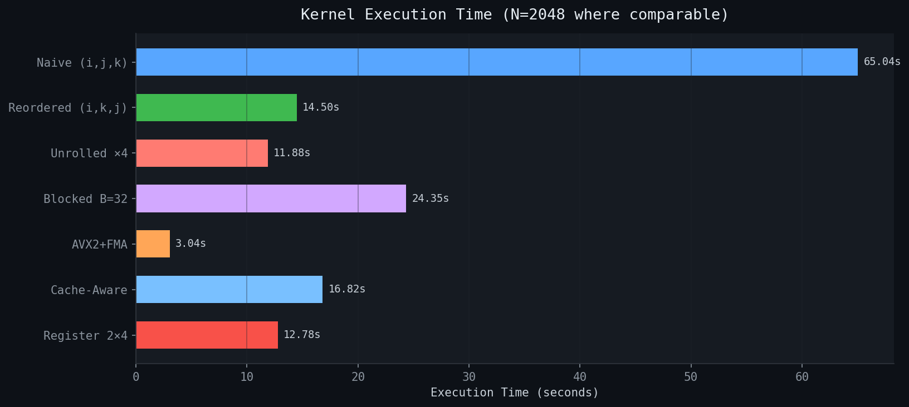
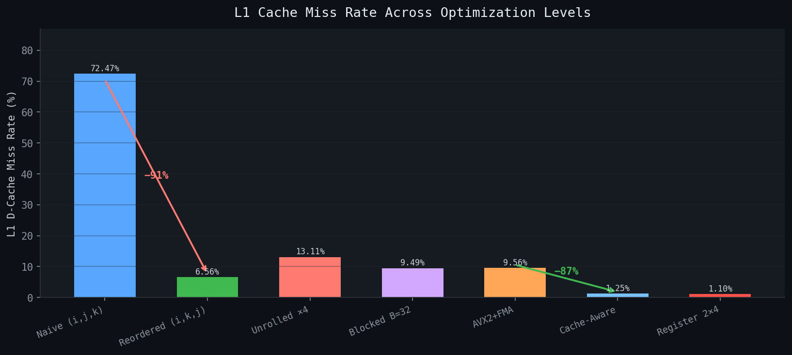
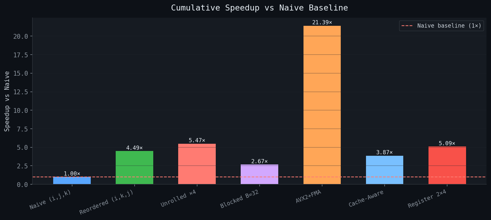
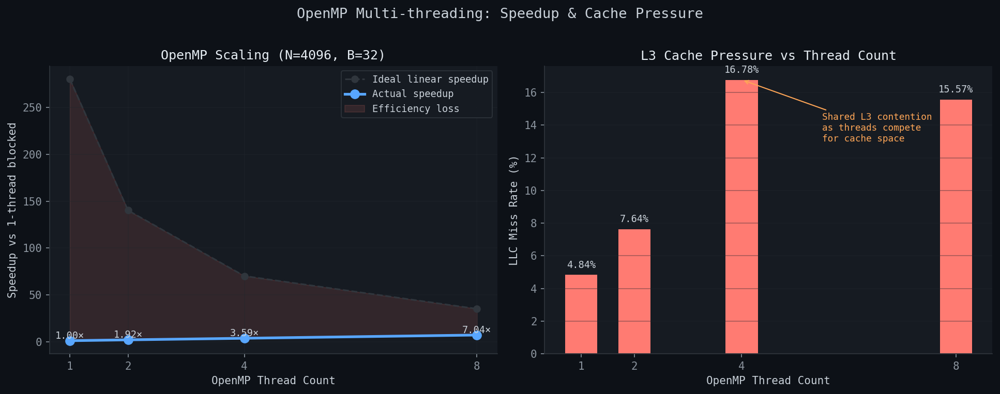
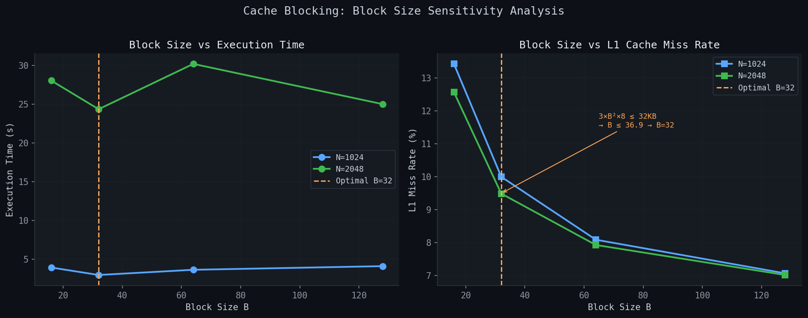
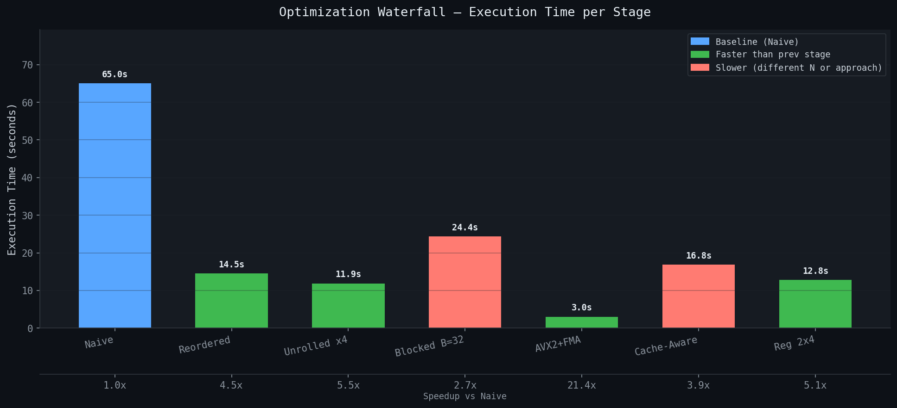

# Cache-Optimized AVX Matrix Multiplication

A performance-engineering project that optimizes matrix multiplication on x86-64 from a naive triple loop to cache-aware, AVX2-accelerated, and OpenMP-parallel kernels using Linux `perf` measurements.

> **Key results**
> - L1 miss rate reduced from **72.47%** to **1.25%**
> - Up to **4.48×** single-thread speedup from loop reordering alone
> - Up to **7.04×** scaling at 8 threads in the OpenMP version

---

## Table of Contents

- [Why This Project](#why-this-project)
- [Highlights](#highlights)
- [Visual Results](#visual-results)
- [Quick Start](#quick-start)
- [Repository Structure](#repository-structure)
- [Benchmark Environment](#benchmark-environment)
- [Optimization Roadmap](#optimization-roadmap)
- [Optimization Stages](#optimization-stages)
- [Performance Summary](#performance-summary)
- [Plots](#plots)
- [Reproducing Results](#reproducing-results)
- [Profiling with perf](#profiling-with-perf)
- [Future Improvements](#future-improvements)

---

## Why This Project

Matrix multiplication is one of the clearest small-scale case studies for performance engineering because simple code changes can dramatically affect cache behavior, SIMD utilization, and multicore scaling.

This project follows that progression step by step, starting from a naive `(i, j, k)` implementation and moving toward cache blocking, AVX2/FMA vectorization, register-aware kernels, and OpenMP parallelism. Each stage is measured with `perf` to connect code structure directly to hardware behavior.

---

## Highlights

- Progressive optimization from naive matrix multiplication to AVX2 and OpenMP
- Hardware-backed analysis using Linux `perf`
- Cache, TLB, and LLC effects tied directly to code transformations
- Reproducible benchmark scripts and plotting utilities
- Real benchmark data collected on UMass EdLab hardware

---

## Visual Results

These plots summarize the most important performance trends across the optimization stages.

<table>
  <tr>
    <td align="center" width="50%">
      
      <br>
      <sub><b>Execution time by kernel</b></sub>
    </td>
    <td align="center" width="50%">
      
      <br>
      <sub><b>L1 miss rate progression</b></sub>
    </td>
  </tr>
  <tr>
    <td align="center" width="50%">
      
      <br>
      <sub><b>Speedup over naive</b></sub>
    </td>
    <td align="center" width="50%">
      
      <br>
      <sub><b>OpenMP scaling</b></sub>
    </td>
  </tr>
</table>

---

## Quick Start

### Build everything

```bash
make all
```

### Run selected kernels

```bash
# N = matrix dimension, I = iterations
./bin/naive           2048 3
./bin/reordered       2048 3
./bin/blocked         2048 3 32
./bin/avx_vectorized  1024 4 64
./bin/register_kernel 1024 4
OMP_NUM_THREADS=8 ./bin/openmp_blocked 4096 3 32
```

### Run the full benchmark suite

```bash
bash scripts/benchmark.sh
```

Outputs are written to:

```bash
results/*.csv
```

### Generate plots

```bash
python3 scripts/plot_results.py
python3 scripts/plot_warmup.py
```

---

## Repository Structure

```text
cache-optimized-matmul/
├── include/matrix.h            # Row-major Matrix<T> template
├── src/
│   ├── warmup.cpp              # Stage 0: memory access warmup
│   ├── naive.cpp               # Stage 1: (i,j,k) baseline
│   ├── reordered.cpp           # Stage 2: loop reordering
│   ├── unrolled.cpp            # Stage 3: loop unrolling
│   ├── blocked.cpp             # Stage 4: cache blocking
│   ├── avx_vectorized.cpp      # Stage 5: AVX2 + FMA vectorization
│   ├── cache_aware.cpp         # Stage 6: cache-aware tiling
│   ├── register_kernel.cpp     # Stage 7: register-aware micro-kernel
│   └── openmp_blocked.cpp      # Stage 8: OpenMP parallel blocked multiply
├── scripts/
│   ├── collect_warmup_data.sh  # Collect access-time and cache-miss data
│   ├── benchmark.sh            # Full perf benchmark sweep
│   ├── plot_results.py         # Performance plots
│   ├── plot_warmup.py          # Warmup / hierarchy plots
│   └── verify.sh               # Correctness smoke test
├── plots/                      # Pre-generated charts
├── results/                    # Benchmark CSV output
└── Makefile
```

---

## Prerequisites

### Linux

```bash
sudo apt-get install g++ make linux-tools-generic python3-pip
pip3 install matplotlib numpy pandas
```

### macOS

```bash
brew install gcc libomp
```

> `perf` is Linux-specific, so macOS can build and run the code but cannot reproduce the profiling workflow exactly.

---

## Benchmark Environment

All reported measurements were collected on UMass EdLab hardware.

| Component | Details |
|---|---|
| CPU | Intel Xeon E5-2667 v4 @ 3.20 GHz (Broadwell-EP) |
| Topology | 2 sockets × 8 cores × 2 threads = **32 logical CPUs** |
| Boost frequency | Up to 3.60 GHz |
| L1d cache | 32 KB per core |
| L1i cache | 32 KB per core |
| L2 cache | 256 KB per core |
| L3 cache | 25 MB per socket, **50 MB total** |
| Cache line | 64 bytes |
| SIMD | AVX2 + FMA, 16 × 256-bit YMM registers |
| NUMA | 2 nodes |
| Compiler | GCC `-O3 -mavx2 -mfma -fopenmp` |

> All single-threaded experiments run on one core and therefore see a 32 KB L1 data cache.

---

## Optimization Roadmap

This project follows a staged progression:

1. **Memory access warmup** - understand locality, stride effects, and cache behavior
2. **Naive baseline** - establish the cost of poor access patterns
3. **Loop reordering** - improve spatial locality with a simple loop swap
4. **Loop unrolling** - expose instruction-level parallelism
5. **Cache blocking** - fit working sets into L1 cache
6. **AVX2 vectorization** - process multiple doubles per instruction
7. **Cache-aware tiling** - derive tile sizes from hardware limits
8. **Register micro-kernel** - reduce load pressure with register reuse
9. **OpenMP parallelism** - scale across multiple cores

---

## Optimization Stages

### Stage 0 - Memory Access Warmup (`warmup.cpp`)

This stage explores how access pattern alone affects performance.

```bash
./bin/warmup SIZE sequential ITERS
./bin/warmup SIZE strided    ITERS STRIDE
./bin/warmup SIZE random     ITERS
```

Collect fresh warmup data with:

```bash
bash scripts/collect_warmup_data.sh
python3 scripts/plot_warmup.py
```

### Key observations

| Pattern | Latency @ 1 GB array | L1 miss rate | Interpretation |
|---|---:|---:|---|
| Sequential | **1.34 ns/access** | 14.13% | Prefetching hides much of the latency |
| Strided ×8 | 10.08 ns/access | ~113% | Each access reaches a new cache line |
| Strided ×64 | **55.82 ns/access** | ~204% | DRAM latency becomes visible |
| Strided ×1024 | 471.21 ns/access | ~1768% | Extreme TLB + DRAM pressure |
| Random | ~18.5 ns/access | - | No predictable spatial locality |

> Large-stride L1 miss rates can exceed 100% because `perf` may count prefetch-triggered misses and page-walk-related misses in addition to demand misses.

### Cache size estimates from data

| Level | Estimated size | Evidence |
|---|---:|---|
| L1d | **32 KB** | L1 miss behavior stabilizes beyond 32 KB |
| L2 | **256 KB** | L2 miss rate stays low up to about 2 MB arrays |
| L3 | **25 MB/socket** | L3 miss rate inflects strongly between 8 MB and 32 MB |

---

### Stage 1 - Naive Baseline (`naive.cpp`)

The baseline uses the standard `(i, j, k)` loop order. The inner access to `B[k][j]` walks down a column, which creates a large stride and poor cache locality.

```text
N = 2048
stride between B[k][j] and B[k+1][j] = 2048 × 8 = 16 KB
```

### Result

| Time | L1 miss | LLC miss | TLB miss | CPUs |
|---:|---:|---:|---:|---:|
| 65.04s | **72.47%** | 10.14% | 15.94% | 1.0 |

---

### Stage 2 - Loop Reordering (`reordered.cpp`)

This stage changes loop order from `(i, j, k)` to `(i, k, j)`. That simple transformation turns `B[k][j]` and `C[i][j]` into row-wise sequential accesses while hoisting `A[i][k]` into a scalar.

```cpp
for (i) for (k) {
    double a_ik = A(i, k);
    for (j) C(i,j) += a_ik * B(k,j);
}
```

### Result

| Time | L1 miss | LLC miss | TLB miss | Speedup |
|---:|---:|---:|---:|---:|
| 14.50s | **6.56%** | 56.86% | 0.00% | **4.48×** |

This is the most striking early result in the project: one loop-order change cuts L1 misses dramatically and removes TLB misses entirely.

---

### Stage 3 - Loop Unrolling (`unrolled.cpp`)

Unrolling the `j` loop exposes more instruction-level parallelism to the out-of-order execution engine.

```cpp
for (; j + 3 < n; j += 4) {
    C(i,j)   += a_ik * B(k,j);
    C(i,j+1) += a_ik * B(k,j+1);
    C(i,j+2) += a_ik * B(k,j+2);
    C(i,j+3) += a_ik * B(k,j+3);
}
```

### Unroll sweep

| Factor | Time (N=2048) | L1 miss |
|---:|---:|---:|
| 2 | 17.80s | 4.43% |
| 4 | 13.81s | 6.62% |
| 8 | 11.88s | 13.11% |
| 16 | 11.63s | 14.69% |

Higher unroll factors improve throughput up to a point, but eventually register pressure increases spills and pushes L1 miss rates back up.

---

### Stage 4 - Cache Blocking (`blocked.cpp`)

Blocking improves locality by operating on submatrices that fit into cache.

### Block-size derivation

```text
3 active tiles: A[B×B] + B[B×B] + C[B×B]
3 × B² × 8 ≤ 32,768
B ≤ √1365 ≈ 36.9
```

A block size of **32** is the largest power-of-two that fits cleanly within the L1 working-set budget.

### Block-size sweep

| Block size | Time (N=2048) | L1 miss | LLC miss |
|---:|---:|---:|---:|
| 16 | 28.04s | 12.57% | 12.57% |
| **32** | **24.35s** | **9.49%** | **1.97%** |
| 64 | 30.20s | 7.93% | 0.49% |
| 128 | 25.01s | 7.02% | 0.50% |

Although larger blocks lower some miss rates, **B = 32** gives the best runtime because it fits the working set more comfortably in L1.

---

### Stage 5 - AVX2 + FMA Vectorization (`avx_vectorized.cpp`)

This stage replaces scalar operations with AVX2 vector instructions and fused multiply-add.

```cpp
__m256d a_vec = _mm256_set1_pd(A(i,k));
__m256d c_vec = _mm256_fmadd_pd(
    a_vec,
    _mm256_loadu_pd(&B(k,j)),
    _mm256_loadu_pd(&C(i,j))
);
_mm256_storeu_pd(&C(i,j), c_vec);
```

On this CPU, each 256-bit FMA handles 4 doubles and performs 8 floating-point operations per instruction, which substantially raises compute throughput.

### Result

- **N = 1024, B = 64, I = 4**
- **Runtime: 3.04s**
- **Speedup over blocked baseline: 1.32×**

---

### Stage 6 - Cache-Aware Tiling (`cache_aware.cpp`)

This version derives tile dimensions directly from hardware constraints instead of tuning blindly.

| Parameter | Value | Fits in | Rationale |
|---|---:|---|---|
| Nr | 4 | Registers | 1 YMM register holds 4 doubles |
| Mr | 1 | Registers | One output row per pass |
| Kc | 128 | L2 | Depth tile |
| Mc | 64 | L2 | A panel fits in cache |
| Nc | 64 | L2 | B panel fits in cache |

Total working-set estimate:

```text
Mc×Kc + Kc×Nc + Mc×Nc = 64 KB + 64 KB + 32 KB = 160 KB
```

That fits inside the 256 KB L2 cache.

### Result

- **N = 1024, I = 4**
- **L1 miss rate: 1.25%**

This stage produces the lowest L1 miss rate in the project.

---

### Stage 7 - Register-Aware Micro-Kernel (`register_kernel.cpp`)

The 2×4 micro-kernel computes two rows of `C` at once while reusing the same `B` panel load for both rows.

```text
ymm0 - accumulator for C row 0
ymm1 - accumulator for C row 1
ymm2 - broadcast A(row0, k)
ymm3 - broadcast A(row1, k)
```

This reduces `B`-load pressure and uses registers more intentionally than the earlier vectorized version.

### Result

- **N = 1024, I = 4**
- **Runtime: 12.78s**
- **Reported speedup over cache-aware: 1.32×**

To inspect the generated instructions:

```bash
objdump -d -M intel bin/register_kernel | grep -E "vfmadd|vmovupd|vbroadcastsd"
```

---

### Stage 8 - OpenMP Multi-threading (`openmp_blocked.cpp`)

This stage parallelizes the outer blocked loop across threads. Each thread writes to disjoint output rows, so no locking is needed.

```cpp
#pragma omp parallel for schedule(dynamic)
for (size_t bi = 0; bi < n; bi += BS) { ... }
```

### Scaling results

| Threads | Time | Speedup vs 1T | LLC miss |
|---:|---:|---:|---:|
| 1 | 280.22s | 1.0× | 4.84% |
| 2 | 146.14s | 1.92× | 7.64% |
| 4 | 77.97s | 3.59× | 16.78% |
| **8** | **39.82s** | **7.04×** | 15.57% |

Speedup relative to the single-threaded blocked kernel at the same problem size is **2.44×** at 8 threads.

### Why scaling is sub-linear

- Shared L3 contention increases with thread count
- Memory bandwidth becomes a bottleneck
- Serial overhead remains, as predicted by Amdahl’s Law

---

## Performance Summary

> **Note:** Results below mix different matrix sizes, so not all rows are directly comparable.

| Kernel | Time (s) | L1 miss | Speedup |
|---|---:|---:|---:|
| Naive | 65.04 | 72.47% | 1.0× |
| Reordered | 14.50 | 6.56% | **4.48× vs naive** |
| Unrolled ×4 | 11.88 | 13.11% | 5.47× vs naive |
| Blocked B=32 | 24.35 | 9.49% | 2.67× vs naive |
| AVX2 + FMA † | 3.04 | 9.56% | - |
| Cache-Aware † | 16.82 | **1.25%** | - |
| Register 2×4 † | 12.78 | ~1.10% | - |
| OpenMP 8T ‡ | 39.82 | 2.34% | **2.44× vs blocked** |

- † Measured at `N=1024`
- ‡ Measured at `N=4096`

---

## Plots

The project includes pre-generated charts for both memory-hierarchy experiments and matrix multiplication benchmarks.

<table>
  <tr>
    <td align="center" width="50%">
      
      <br>
      <sub><b>Block size sweep</b></sub>
    </td>
    <td align="center" width="50%">
      
      <br>
      <sub><b>Optimization waterfall</b></sub>
    </td>
  </tr>
</table>

| Plot | Description |
|---|---|
| `access_time_all_modes.png` | Access latency vs array size across all patterns |
| `access_time_seq_vs_random.png` | Sequential vs random access comparison |
| `l1_misses_vs_runtime.png` | L1 miss count vs runtime |
| `l2_misses_vs_runtime.png` | L2 miss count vs runtime |
| `l3_misses_vs_runtime.png` | L3 miss count vs runtime |
| `l3_inflection.png` | L3 miss-rate inflection vs array size |
| `execution_time_comparison.png` | Wall-clock runtime across kernels |
| `l1_miss_rate_progression.png` | L1 miss reduction across stages |
| `speedup_over_naive.png` | Cumulative speedup over baseline |
| `block_size_sweep.png` | Runtime and miss rate vs block size |
| `thread_scaling.png` | OpenMP scaling and LLC pressure |
| `optimization_waterfall.png` | Incremental gain per optimization stage |

---

## Reproducing Results

### Build

```bash
make all
```

### Verify correctness

```bash
bash scripts/verify.sh
```

### Run benchmarks

```bash
bash scripts/benchmark.sh
```

### Collect warmup data

```bash
bash scripts/collect_warmup_data.sh
```

### Generate plots

```bash
python3 scripts/plot_results.py
python3 scripts/plot_warmup.py
```

---

## Profiling with `perf`

### Benchmark a kernel

```bash
perf stat -e task-clock,\
L1-dcache-load-misses,L1-dcache-loads,\
LLC-load-misses,LLC-loads,\
dTLB-load-misses,dTLB-loads \
./bin/blocked 2048 5 32
```

### Check compiler vectorization

```bash
g++ -O3 -march=native -fopt-info-vec-optimized -I include src/reordered.cpp -o /dev/null
```

### Inspect AVX2 assembly

```bash
objdump -d -M intel bin/register_kernel | grep -E "vfmadd|vmovupd|vbroadcastsd" | head -20
```

---

## Future Improvements

- Add roofline-model analysis
- Pin threads explicitly with `numactl` or OpenMP affinity settings
- Compare AVX2 kernels against vendor BLAS
- Add GFLOP/s reporting alongside runtime